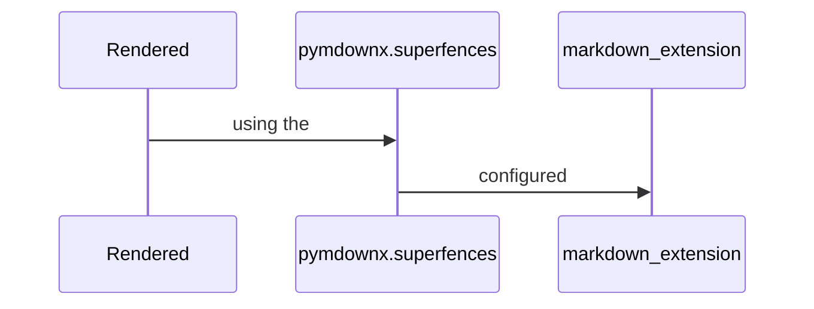

# Test Site

# Markdown Extensions

!!! example

    Rendered using the `admonitions` **markdown_extension**

# Configured Markdown Extensions

```mermaid
sequenceDiagram
    Rendered->>pymdownx.superfences: using the
    pymdownx.superfences->>markdown_extension: configured
```

# Plugins


